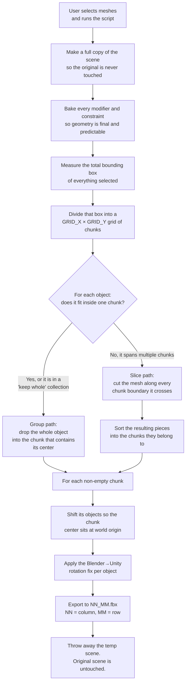

# chunks_export.py

A Blender script that takes a big scene (a whole city, a landscape, a level)
and chops it into a regular grid of small `.fbx` files. The Unity side of the
pipeline (`unity/chunks/`) then loads each file into its own scene and streams
them in and out based on the player position.

This README explains **what the script does and why** in plain language, so
you don't need to know Blender or 3D graphics to follow it.

## The mental model

Imagine you have a giant printed map laid out on the floor. You want to mail
it to a friend, but it doesn't fit in any envelope. So you do the obvious
thing:

1. Draw a grid on top of the map.
2. Cut along the grid lines with scissors.
3. Put each square in its own envelope.
4. Label every envelope with its row and column so your friend can lay the
   map back out in the right order.

That is exactly what the script does, except:
- "Map" = the 3D scene you selected in Blender.
- "Scissors" = a geometric operation that cuts a 3D mesh along a plane.
- "Envelopes" = individual `.fbx` files named `NN_MM.fbx` (column, row).
- "Friend" = Unity, which reassembles them on the other side.

## What you do as a user

1. Open the `.blend` file with your scene.
2. Select the meshes you want to chunk (press **A** in the viewport to
   select everything).
3. Open the **Text Editor**, load `chunks_export.py`, and press **Run
   Script**.
4. Wait. The script writes `NN_MM.fbx` files into `chunks_export/` next to
   your `.blend` file, plus a `chunks_export.log` you can inspect if
   something goes wrong.

Your original scene is **never modified**. The script does all its work in
a throw-away copy and deletes it at the end.

## Algorithm overview



## Step-by-step, in plain language

### 1. Copy the scene

The script duplicates your entire scene into a temporary one called
`__chunks_temp__`. Everything that follows happens in the copy, so even if
something goes wrong the original is safe.

### 2. Bake modifiers and constraints

Blender objects often have **modifiers** (procedural effects like "duplicate
this fence 30 times along that curve") and **constraints** (rules like "stick
this house to the terrain surface"). The script "bakes" them — meaning the
procedural results become permanent, plain geometry. After this step every
object is exactly what you see, with no hidden behavior that could re-fire
later and shift things around.

### 3. Measure the world

The script walks through every selected object and finds the total bounding
box — the smallest axis-aligned rectangle that contains everything. From that
it computes how big a single chunk needs to be:

```
chunk width  = total width  / GRID_X
chunk height = total height / GRID_Y
```

### 4. Decide: slice or keep whole?

For every object the script asks two questions:

- **Is its collection name on the "keep whole" list?** (`KEEP_WHOLE_KEYWORDS`,
  e.g. `Buildings`). Buildings and similar tall, complex assets must never
  be cut in half — a sliced building looks wrong from every angle.
- **Is it small enough to fit inside one chunk?** If yes, no cutting needed.

If the object passes either check, it goes to the **group path** — it just
gets dropped into whichever chunk contains its center.

Otherwise it goes to the **slice path** — typically large flat things like
terrain, roads, rivers, or sidewalks that genuinely cross multiple chunks.

### 5. Slicing (the only tricky bit)

For each object that needs slicing, the script:

1. Reads the mesh into a low-level container called a **BMesh**.
2. Cuts it along every vertical grid line it crosses (left-to-right).
3. Cuts it along every horizontal grid line it crosses (top-to-bottom).
4. Looks at every resulting face and asks "whose chunk is your center in?"
5. Groups faces by chunk and builds a new mesh per chunk.

Two subtle things the script protects against:

- **Seam artifacts.** When two pieces of geometry have vertices that are
  almost-but-not-quite at the same spot, you get visible cracks. The script
  merges near-duplicate vertices before cutting (`MERGE_DOUBLES`).
- **Flipped faces.** Cutting can confuse some algorithms into reversing the
  "outside" direction of faces, which makes parts of the mesh look black or
  invisible. The script snapshots the original face directions before
  cutting and restores them afterwards.

### 6. Re-center each chunk

Unity expects each chunk's FBX file to be centered around its own origin
(`0, 0, 0`), not floating somewhere far away in world space. So before
export the script shifts each chunk's geometry so the chunk's center sits
at the origin. Unity then places the chunk back at the right spot using the
filename — `05_03.fbx` means column 5, row 3.

### 7. Fix the rotation for Unity

Blender and Unity disagree about which axis points up (Blender says Z,
Unity says Y). Without compensation, every imported model would land on its
side in Unity. The script applies the well-known
[Edy Garcia rotation trick](https://github.com/EdyJ/blender-to-unity-fbx-exporter)
so the FBX lands in Unity with a clean identity transform — no scale of 100,
no 90° spin, nothing the Unity importer needs to undo.

### 8. Export and clean up

Each non-empty chunk is exported as `NN_MM.fbx`. Empty chunks (cells that
ended up with no geometry) are skipped, so you don't get a folder full of
empty files. Finally the temporary scene is deleted along with all the
copies it held, leaving your original `.blend` exactly as it was.

## Configuration (the constants at the top of the file)

| Setting | What it does |
|---|---|
| `GRID_X`, `GRID_Y` | Number of columns and rows in the grid. `8 × 8 = 64` chunks. |
| `KEEP_WHOLE_KEYWORDS` | Collection name substrings whose objects are never sliced. Default: `['Buildings']`. |
| `SLICE_SIZE_RATIO` | An object enters the slice path if its bounding box is at least this fraction of a chunk on either axis. `0.99` means "slice anything that doesn't fit inside one chunk." |
| `OUTPUT_DIR` | Where the `.fbx` files are written. `//chunks_export/` is relative to the `.blend` file. |
| `MERGE_DOUBLES` | Merge near-duplicate vertices before cutting to prevent seams. Leave `True`. |
| `DO_EXPORT` | Set to `False` to do everything except the FBX write — useful when you want to debug the slicing visually without producing files. |

## Output

- `chunks_export/NN_MM.fbx` — one file per non-empty chunk.
  `NN` is the column index along Blender's X axis; `MM` is the row index
  along Blender's Y axis. Both are zero-padded to two digits.
- `chunks_export/chunks_export.log` — full text log of what the run did:
  bounding box, chunk size, slice/group counts, per-chunk export lines,
  and any warnings (e.g. degenerate faces dropped during slicing). Read
  this first if something looks wrong.

## When things go wrong

- **"Select mesh objects first."** You ran the script with nothing
  selected. Press **A** in the viewport, then run again.
- **"Bounding box has zero span."** Your selection collapses to a single
  point or a flat line. Check that the selected objects actually have
  geometry.
- **Cracks or seams along chunk boundaries** in Unity. Make sure
  `MERGE_DOUBLES` is `True` and that your source meshes don't have
  overlapping vertices spaced wider than `0.0001` m.
- **A building got chopped in half.** Its collection name doesn't contain
  any of the `KEEP_WHOLE_KEYWORDS`. Add the right keyword (or rename the
  collection) and re-run.
- **Pieces look black or invisible in Unity** after slicing. This is the
  flipped-face problem; the script already guards against it, but if you
  ever see it, check `chunks_export.log` for warnings and report what you
  see — the snapshot/restore pass should have handled it.

## Related

- Unity importer side: `unity/chunks/` (see the project root `README.md`
  for the full pipeline, from OpenStreetMap export to in-game streaming).
- Coordinate-axis mapping and the FBX import contract: see `CLAUDE.md` in
  the project root.
