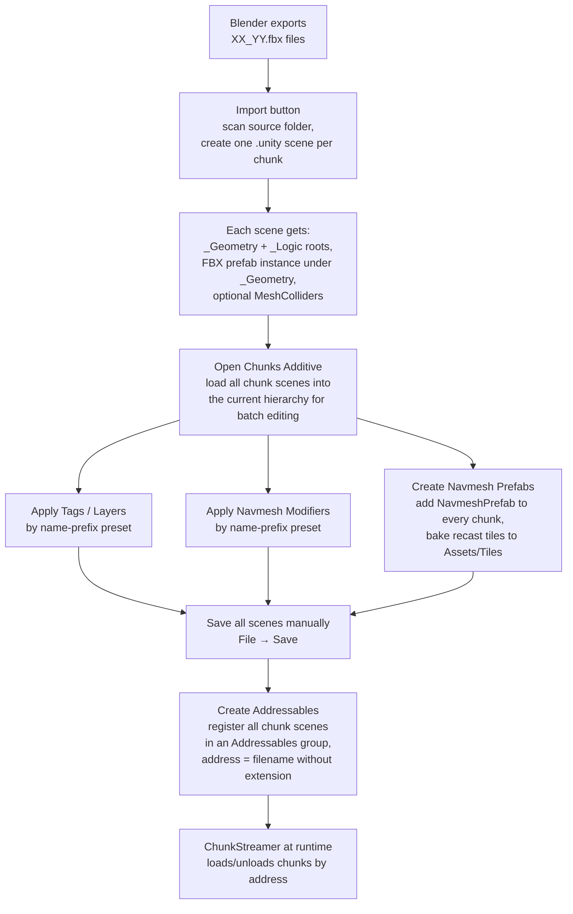

# ChunkManager

A Unity Editor window that turns the pile of `XX_YY.fbx` files exported
from Blender into a fully wired-up, streamable world: per-chunk `.unity`
scene files, per-chunk navmesh tiles for A* pathfinding, bulk-applied
Tags and Layers, and Addressables registration so `ChunkStreamer` can
load them at runtime.

This README explains **what the window does and why** in plain language,
with no assumed Unity background.

## The mental model

Imagine you've received a stack of jigsaw pieces from a friend (the
Blender export). They're all the right shape and they all snap together,
but right now they're just files on disk. Before your game can use them,
each piece needs to:

1. Be unpacked into its own room (a separate Unity **scene**), so the
   game can pick up just the rooms the player is in.
2. Get walls and floors that the player can stand on (mesh **colliders**).
3. Have invisible "this is grass / this is a wall / this is water"
   labels so the navigation AI knows what to do (**navmesh modifiers**,
   **tags**, **layers**).
4. Get a baked-in navigation map so the AI doesn't have to figure out
   how to walk across it from scratch every load (**navmesh prefabs +
   tiles**).
5. Be registered in a phone book so the game can ask "give me piece
   05_03" by name (**Addressables**).

`ChunkManager` is the workshop where all of that happens. It's an editor
window — you click buttons, it does the bulk work, you save the scenes.

## Where it lives

**Tools → Chunks → Chunk Manager** in the Unity menu bar.

The window is a single panel with several collapsible sections, one per
pipeline. Settings persist via `EditorPrefs`, so they survive Unity
restarts.

## The per-chunk scene layout

Every `Chunk_XX_YY.unity` scene the importer creates has exactly two
top-level objects:

```
Chunk_05_03.unity
├── _Geometry            ← managed by ChunkManager (FBX prefab + colliders + navmesh + tags + layers)
│   └── 05_03 (FBX prefab instance, kept connected to the .fbx asset)
└── _Logic               ← yours, never touched by any button in this window
    └── (whatever runtime logic you want: enemies, NPCs, triggers, …)
```

The split exists so you can put hand-authored logic into a chunk scene
without worrying that "Import" or "Apply Navmesh Modifiers" will stomp
on it. Every batch operation in this window walks **only** the
`_Geometry` subtree. `_Logic` is yours forever.

## The full pipeline at a glance



## Pipeline 1: Import

**Button:** Import

Scans the **Source folder** for files named `XX_YY.fbx`. For each one it
creates (or updates) `Chunk_XX_YY.unity` in the **Dest folder**, with the
two-root layout shown above.

The key behavior is **ensure-instance**, not "rebuild":

- If the scene doesn't exist on disk → create it from scratch with
  `_Geometry`, `_Logic`, the FBX as a connected prefab instance, and
  (if enabled) MeshColliders.
- If the scene already exists → open it, make sure both roots are
  present, and add the FBX prefab instance **only if no connected
  instance of that same FBX is already under `_Geometry`**.

What this protects against:

- **Re-importing won't duplicate chunks** in a scene.
- **Re-importing won't reset transforms** the user manually adjusted.
- **Re-importing won't stomp on prefab overrides** the user applied.
- **When you re-export the Blender FBX, existing chunks pick up the new
  geometry automatically** through Unity's prefab → FBX reimport link —
  you don't need to click anything.

### Position math

Each chunk scene's `_Geometry` and `_Logic` roots are placed at the
chunk's world-space center, with the entire grid centered at world origin:

```
u = (col + 0.5 - countA/2) * chunkSize
v = (row + 0.5 - countB/2) * chunkSize
rootPos = (u, 0, v)
```

This formula matches `ChunkStreamer.ChunkWorldCenter`. As long as
`chunkSize` matches on both sides, the streamer will look for chunks in
the right place.

### The Blender→Unity axis flip

`ImportOne` forces `bakeAxisConversion = true` on every FBX. This makes
Unity bake the Blender→Unity coordinate fix (Z-up → Y-up, etc.) into the
mesh data, so the FBX root lands in the chunk scene with a clean identity
transform instead of a compensating 90° rotation. The setting is
idempotent — only writes when not already on.

## Pipeline 2: Delete Chunks

**Button:** Delete Chunks

Deletes every `<sceneNamePrefix>*.unity` file from the Dest folder. There
is a confirmation dialog — it's a destructive action. It does **not**
touch anything currently open in the hierarchy; close those scenes
first if you also want them gone.

## Pipeline 3: Scene operations (hierarchy management)

These buttons act on chunk scenes **in the current edit-time hierarchy**,
not on disk:

| Button | What it does |
|---|---|
| **Open Chunks Additive** | Loads every chunk scene from Dest folder into the hierarchy alongside the currently active scene. Skips scenes already open. |
| **Load** | For chunk scenes already in the hierarchy but currently unloaded, loads them. |
| **Unload** | Closes loaded chunk scenes but leaves them in the hierarchy list (so a single click can load them again). |
| **Remove** | Removes chunk scenes from the hierarchy entirely (does not delete the files on disk). |

Use **Open Chunks Additive** before any of the bulk operations below —
they only act on scenes currently loaded in the hierarchy.

## Pipeline 4: Navmesh Prefabs (A* Pathfinding Pro)

**Buttons:** Create Navmesh Prefab, Delete Tiles

> Requires [A* Pathfinding Pro](https://arongranberg.com/astar/). For the
> NavMesh-free variant, see the `manager-no-navmesh/` folder.

For every chunk scene currently loaded, walks the immediate children of
`_Geometry` and attaches an `NavmeshPrefab` component to each one. The
prefab's bounds are set to `chunkSize × Y × chunkSize` (Y is read from
the parent scene's RecastGraph), then `ScanAndSaveToFile()` bakes a
per-chunk tile `.bytes` into `Assets/Tiles/`.

This is decoupled from Import deliberately: if you tweak the
RecastGraph's settings in the parent scene, you can re-bake all chunks
without re-importing the FBX.

**Delete Tiles** wipes everything under `Assets/<tilesDestFolder>/*.bytes`
recursively. Use it before re-baking from scratch.

## Pipeline 5: Apply Navmesh Modifiers (A* Pathfinding Pro)

**Buttons:** Add Config, Apply Modifiers

Lets you define a list of **name-prefix presets**. Each preset says:

> "Any GameObject inside `_Geometry` whose name starts with `Road_`
> should get a `RecastNavmeshModifier` set to mode `WalkableSurface`,
> surface ID 2, …"

You configure as many presets as you want, then click **Apply Modifiers**.
The window walks every loaded chunk scene's `_Geometry` subtree,
attaches a `RecastNavmeshModifier` to every match, and copies the preset
values onto it. Presets are evaluated in list order; the first match
wins (so list specific prefixes before generic ones).

This is decoupled from Import for the same reason as navmesh tiles —
you can iterate on rasterization settings without touching the FBX.

## Pipeline 6: Apply Tags / Layers

**Buttons:** Add Tag Config, Apply Tags / Add Layer Config, Apply Layers

Same name-prefix idea as Apply Navmesh Modifiers, but for Unity Tags
and Layers. Each preset says "objects starting with X get tag Y" or
"objects starting with X get layer Y".

The Tag / Layer picker only lets you pick from values **already defined
in the project** (Project Settings → Tags and Layers). This step never
creates new tags or layers; if you need one that doesn't exist yet, add
it to the project first.

## Pipeline 7: Addressables

**Buttons:** Create, Delete, Open Addressables Groups Window

Registers every `<sceneNamePrefix>*.unity` scene from Dest folder into
an Addressables group named after the **Group Name** field (default
`Scenes`). The group is created if it doesn't already exist.

If **Simplify Names** is on, each entry's address is rewritten to
just the filename without extension, e.g. `Chunk_05_03`. This is the
format `ChunkStreamer` queries by, so leave it on unless you have a
specific reason not to.

**Delete** removes the group and every entry it owns (with confirmation).

## Settings reference

### Chunk Files

| Field | What it does |
|---|---|
| **Source folder** | Assets-relative folder holding the FBX chunks exported from Blender. Filenames must be `XX_YY.fbx` exactly (zero-padded). Subfolders are not scanned. |
| **Dest folder** | Where the chunk `.unity` scenes are written. Created if missing. |
| **Chunk size** | Size of one grid cell in meters. **Must match** the Blender export AND `ChunkStreamer.chunkSize` in the runtime scene. |
| **Scene prefix** | Prefix for each chunk scene filename. Default `Chunk_`. Final form: `Chunk_05_03.unity`. **Must match** the format `ChunkStreamer` queries by. |
| **Add MeshColliders** | Attach a non-convex MeshCollider to every MeshFilter under each freshly instantiated FBX prefab. Only runs on first import; re-running Import leaves existing colliders alone. |

### Chunk Navmesh Prefabs

| Field | What it does |
|---|---|
| **Tiles dest folder** | Folder name under `Assets/` for navmesh tile `.bytes` files. Only affects **Delete Tiles** — `NavmeshPrefab.SaveToFile` is hardcoded to write into `Assets/Tiles/` regardless. |

### Chunk Navmesh Modifiers / Tags / Layers

Lists of per-prefix presets. See the pipeline sections above. Each row
has a key prefix, a value, and a Remove button. Presets are evaluated
in list order — first match wins.

### Chunk Addressables

| Field | What it does |
|---|---|
| **Group name** | Name of the Addressables group to create/delete. |
| **Simplify names** | After registering, rewrite each entry's address to the filename without extension. Required for `ChunkStreamer` to find scenes. |

## Typical workflow

1. **Export FBX from Blender** with `blender/chunks/chunks_export.py`.
2. **Set Source folder** to where the FBX files landed under `Assets/`.
3. **Set Dest folder** to where you want the chunk scenes.
4. Confirm **Chunk size** matches the Blender export.
5. Click **Import**. Wait for the progress bar.
6. (Optional, only for A* Pathfinding) Click **Open Chunks Additive**,
   then **Create Navmesh Prefab**.
7. (Optional) Define **Tag / Layer / Navmesh Modifier** presets and
   click **Apply** for each.
8. **Save all scenes** (File → Save, or Ctrl+S). The bulk operations
   mark scenes dirty but do not auto-save — you own persistence.
9. Click **Create** under Chunk Addressables to register the scenes.
10. **Open Addressables Groups window** to verify the entries are there.
11. Set up `ChunkStreamer` in your runtime scene (see
    `unity/chunks/streamer/`).

## When things go wrong

- **"Source folder not found."** Path must be Assets-relative and exist
  on disk. Drag the folder from the Project window for safety.
- **"Found 0 XX_YY.fbx files."** Filenames must be exactly two
  zero-padded numbers separated by an underscore, e.g. `05_03.fbx`. The
  Blender script produces them in this form automatically.
- **"No AstarPath with a RecastGraph found."** The Create Navmesh
  Prefab step looks for an active `A*` GameObject in any loaded scene.
  Open your parent scene (the one that owns the world's RecastGraph)
  before running this step.
- **"No loaded chunk scenes with prefix Chunk_."** Click **Open Chunks
  Additive** first — the bulk operations only act on currently loaded
  scenes.
- **Apply Tags / Layers silently did nothing.** Check that the prefix
  actually matches your object names (case-sensitive). Use the Hierarchy
  search to verify.
- **Chunks position wrong in Unity.** Almost always a `chunkSize` /
  `gridSize` mismatch with Blender. Compare the three values: Blender's
  `chunk_w` (from `bbox / GRID_X`), the Chunk Manager's `chunkSize`
  field, and `ChunkStreamer.chunkSize` in the runtime scene.
- **Re-imported FBX doesn't show new geometry.** That should be
  automatic via Unity's prefab → FBX reimport. If it isn't, check that
  the chunk scene's FBX child is still a **connected** prefab instance
  (not unpacked).

## Files in this folder

| File | What it is |
|---|---|
| `ChunkManager.cs` | Window class, persisted settings, UI Toolkit binding, button wiring. |
| `ChunkManager.Import.cs` | FBX → per-chunk `.unity` scene pipeline. Ensure-instance semantics. |
| `ChunkManager.Scenes.cs` | Open / Load / Unload / Remove / Delete operations on chunk scenes. |
| `ChunkManager.Navmesh.cs` | NavmeshPrefab creation + RecastNavmeshModifier apply (A* Pathfinding Pro). |
| `ChunkManager.TagsLayers.cs` | Bulk Tag / Layer assignment by name-prefix preset. |
| `ChunkManager.Addressables.cs` | Addressables group create / delete. |
| `ChunkManager.uxml` | UI Toolkit layout for the window. |
| `ChunkManager.uss` | Stylesheet for the window layout. |

## Related

- Runtime streaming: `unity/chunks/streamer/` — the `ChunkStreamer`
  component that loads / unloads chunk scenes at runtime by Addressables
  address, using the format this window registers.
- Blender export: `blender/chunks/` — the script that produces the
  `XX_YY.fbx` files this window imports.
- See the project root `README.md` for the full pipeline overview.
- Companion folder `manager-no-navmesh/` — same window without A*
  Pathfinding integration, for projects that don't use it.
