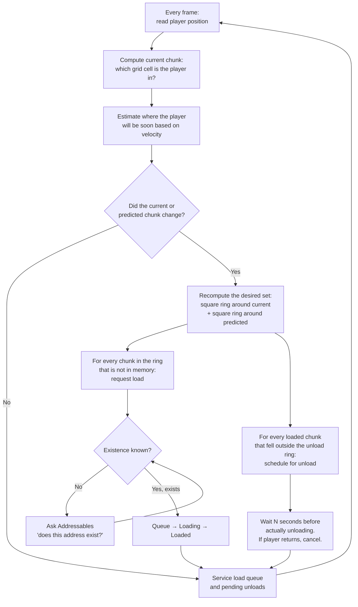
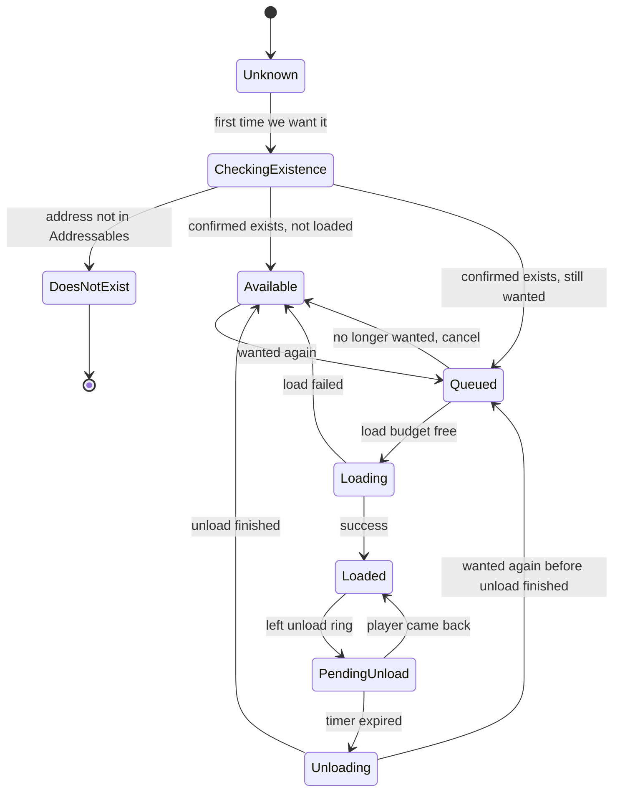

# ChunkStreamer

The runtime side of the chunk pipeline. While the player walks around the
world, this component watches their position and asks Unity's Addressables
system to **load nearby chunks** and **unload distant ones** — so the whole
city is never in memory at once, but everything the player can see (and
soon will see) always is.

This is the piece of the pipeline that turns a folder full of
`Chunk_XX_YY.unity` scenes into a seamless, streamed open world.

The streamer itself is **DI-free and self-contained** — it has no VContainer
dependency and nothing is injected into it. The optional DI layer
(`unity/chunks/bootstrap/` + `unity/chunks/scope/`) attaches from the
outside: a root-scope `ChunkRegistryBinder` subscribes to the two public
events below and publishes each loaded chunk's `IChunkContext` into a
global `IChunkRegistry`, so root-scope services (spawners, quest system,
minimap) can react to chunks without singletons or `FindObjectsOfType`.

This README explains **what it does and why** in plain language, with no
assumed Unity background.

## The mental model

Think of a paper road map that's far too big to lay flat on a table. Now
imagine a magic spotlight that follows you around the map, and a friend
sitting next to the table whose job is:

- Always make sure the squares **right under the spotlight** are laid out
  on the table.
- When you walk away from a square, **wait a few seconds** before tidying
  it back into the drawer — in case you turn around and come back.
- If you start walking quickly in a direction, **lay out the next square
  ahead of you** before you actually get there, so you never see an empty
  table.

That friend is `ChunkStreamer`. The "table" is the player's Unity scene;
the "drawer" is Addressables (Unity's on-demand asset loader); each
"square" is one `Chunk_XX_YY.unity` scene file.

## What you do as a user

1. Make sure your chunks have been imported into scenes and registered as
   Addressables (see `unity/chunks/manager/`).
2. Create an empty GameObject in your runtime scene.
3. Add the **ChunkStreamer** component to it.
4. Drag your player (or main camera) into the **Target** field.
5. Make sure **Chunk Size** and **Grid Size** match what you used in
   Blender and in the Chunk Manager. A mismatch puts chunks at wrong
   positions and the player ends up in a chunk that nobody loaded.
6. Press Play.

That's it. The streamer reads the player's position every frame and does
all the load/unload bookkeeping internally.

## Algorithm overview



## How distance is measured: "rings", not circles

The streamer uses **Chebyshev distance** — also called the "king's distance"
in chess. Two chunks are 1 apart if you can step from one to the other in
a single chess-king move (including diagonals). So:

- `loadRadius = 1` → a **3×3 square** of chunks stays loaded (current
  chunk plus its 8 neighbors).
- `loadRadius = 2` → a 5×5 square.
- `loadRadius = 3` → a 7×7 square.

This is why the gizmos in the Scene view show **squares**, not circles.
The visualization draws a disc only because it's easier to read at a
glance — the actual streaming area is the square.

## Hysteresis: why load radius < unload radius

If "load" and "unload" used the same threshold, a player walking
back-and-forth right on a chunk boundary would cause endless
load/unload/load/unload thrashing — frame spikes and visible pop-in.

The fix is a **buffer band**:

- Chunks within `loadRadius` are actively loaded.
- Chunks within `unloadRadius` (but outside `loadRadius`) **stay in
  memory** without being requested. They're already there; we just don't
  let them stay forever.
- Chunks outside `unloadRadius` get scheduled for unload.

And the unload itself doesn't happen immediately — it goes on a timer
(`unloadDelaySeconds`). If the player walks back into range during that
window, the unload is canceled and the chunk is simply marked loaded
again. Zero I/O, zero pop-in.

## Predictive prefetch: looking ahead

If the player is walking east at a steady speed, loading the chunk
directly under them isn't enough — by the time it finishes loading they're
already standing on top of it. The streamer also loads a **second ring of
chunks N steps ahead in the direction of motion** (`predictiveLoadAhead`).

This kicks in only above `predictiveMinSpeed` (so that microscopic jitter
near zero speed doesn't fire random prefetch in random directions). The
velocity used for prediction is exponentially smoothed
(`velocitySmoothing`) so that brief turns don't whip the prefetch ring
back and forth.

## State machine for one chunk

Each chunk is in one of these states at any moment:



The key insight: once we've confirmed a chunk exists in Addressables, we
**remember** that ("Available") even after unloading it. Re-entering the
chunk doesn't trigger another Addressables existence check — just a
straight reload.

## Load budget: cap on concurrency

`loadBudget` caps how many `LoadSceneAsync` operations can run at the
same time. This isn't a memory cap — loaded chunks stay loaded — it's a
concurrency cap that keeps the I/O subsystem from drowning in parallel
requests after a big change (teleport, fast travel, first frame at Play).

Chunks waiting in the queue are loaded **closest-first** (Euclidean
distance to the player), so the most visible chunks finish first.

## Teleports: `EnsureChunkLoaded`

For fast travel, respawn, or cutscene jumps, you need to **block** until
a chunk is actually loaded — otherwise the player materializes in the
middle of an empty hole. `EnsureChunkLoaded(coord)` returns a `Task<bool>`
you can `await`, with a contract: this chunk **will** be driven to Loaded
even if the player is far away. It bypasses the normal "is the player
near?" gating used everywhere else.

There's also `EnsureChunkLoadedCoroutine(coord)` for the coroutine
crowd.

If you need to **read facets** from the destination chunk (spawn points,
quest data, checkpoint transform, …), use
`ChunkRegistryBinder.EnsureChunkContextReady(coord)` from the DI layer
instead (in `unity/chunks/bootstrap/`). It returns `Task<IChunkContext>`
that resolves once the chunk is loaded **and** its context is in the
registry, or `null` for a missing/failed/geometry-only chunk:

```csharp
class FastTravelService
{
    [Inject] ChunkRegistryBinder _chunks;
    [Inject] IPlayerService _player;

    public async void FastTravel(ChunkCoord dest)
    {
        var ctx = await _chunks.EnsureChunkContextReady(dest);
        if (ctx == null) return;                 // no such chunk / load failed
        if (ctx.Resolver.TryResolve<IPatrolFacet>(out var patrol))
            _player.Transform.position = patrol.PointA.position;
    }
}
```

## DI integration: consuming `IChunkRegistry`

Root-scope services subscribe once and react to every chunk that loads or
unloads, including chunks already loaded before they subscribed (`onReady`
replays on subscribe):

```csharp
class NpcSpawnerService : IStartable, IDisposable
{
    readonly IChunkRegistry _registry;
    IDisposable _subscription;

    public NpcSpawnerService(IChunkRegistry registry) { _registry = registry; }

    public void Start()
        => _subscription = _registry.Subscribe(OnChunkReady, OnChunkGone);

    public void Dispose() => _subscription?.Dispose();

    void OnChunkReady(ChunkCoord c, IChunkContext ctx)
    {
        if (ctx.Resolver.TryResolve<IPatrolFacet>(out var patrol))
            SpawnWolfOn(patrol);                 // your gameplay code
    }

    void OnChunkGone(ChunkCoord c) { /* scene unload destroys the wolves */ }
}
```

Chunks declare what they contain via **facets**: drop a facet component
(e.g. `PatrolFacet`) anywhere under `_Logic`, and the chunk's
`ChunkLifetimeScope` registers it at load. Chunks without a facet simply
don't register it — `TryResolve` is the consumer-side check.

## Persistence hooks

Two events fire so other systems can save/restore per-chunk state:

- `OnAfterChunkLoad(coord, scene)` — just after a chunk finishes loading.
  Use this to restore mutable state (opened containers, defeated enemies,
  player-built objects) into the freshly loaded scene.
- `OnBeforeChunkUnload(coord, scene)` — the very last moment before the
  scene's GameObjects are destroyed. Snapshot whatever needs to survive
  the unload.

These are also the attachment points for the DI layer: `ChunkRegistryBinder`
(in `unity/chunks/bootstrap/`) subscribes to both at startup and mirrors
them into `IChunkRegistry.Register` / `Unregister`. Because it subscribes
first, registry consumers hear about an unload before any later-subscribed
persistence handler runs — and always while the chunk's GameObjects are
still alive. Most gameplay code should consume `IChunkRegistry` (typed
contexts, replay for late subscribers) rather than these raw events; the
raw events remain for code that needs the `Scene` handle itself.

## Gizmo visualization

When the streamer is selected (or the gizmos toggle is on) the Scene view
shows:

- A green disc for the **load ring** around the player.
- A red disc for the **unload ring**.
- A blue disc + arrow for the **predictive ring** (when moving above
  `predictiveMinSpeed`).
- A label over every tracked chunk with its coordinate and current state:
  `LOADED`, `LOADING…`, `QUEUED`, `PENDING UNLOAD` with a countdown,
  `UNLOADING…`, `AVAILABLE`, `CHECKING…`, `NO SCENE`.
- A label over the player marker with the current chunk coordinate.

This is the fastest way to see whether the streamer thinks the player is
in the chunk you think they're in — useful when alignment looks wrong.

## Configuration reference

### Tracking Target

| Field | What it does |
|---|---|
| `target` | The Transform whose position drives every load/unload decision. Usually the player or the main camera. If it gets destroyed mid-game the streamer disables itself. |

### Grid

| Field | What it does |
|---|---|
| `chunkSize` | Size of one chunk in meters. **Must match** the Blender export (`chunk_w` / `chunk_h`) and the Chunk Manager's chunk size. A mismatch puts chunks at wrong physical positions. |
| `gridSize` | Grid size in chunks (X columns, Y rows in chunk-coordinate space; Y maps to Unity's world Z). **Must match** `GRID_X` / `GRID_Y` in the Blender export. Used to translate player position into a chunk coordinate and to cull off-grid requests. |
| `loadRadius` | Chebyshev radius of the area that stays loaded. `1` = 3×3 chunks, `2` = 5×5, etc. Higher = smoother and more visible range, more memory. |
| `unloadRadius` | Chebyshev radius beyond which chunks get scheduled for unload. **Must be greater than `loadRadius`** — the gap is the hysteresis buffer. |

### Performance

| Field | What it does |
|---|---|
| `loadBudget` | Maximum number of `LoadSceneAsync` operations in flight at the same time. Higher = faster catch-up after a teleport, more risk of frame spikes. |
| `unloadDelaySeconds` | Seconds a chunk stays in memory after it leaves the unload ring. If the player walks back into range during this window, the unload is canceled. Smooths zigzag movement near boundaries. |

### Predictive

| Field | What it does |
|---|---|
| `predictiveLoadAhead` | How many chunks ahead (in the direction of motion) the prefetch ring is offset. `0` disables predictive prefetch entirely. Larger = earlier head-start, more peak memory. |
| `predictiveMinSpeed` | Minimum speed (m/s) at which predictive prefetch kicks in. Below this the predicted center collapses onto the real one. Guards against jitter at near-zero speed. |
| `velocitySmoothing` | Time constant (seconds) for exponential smoothing of velocity. Larger = direction is more inertial; smaller = reacts faster but flickers prefetch ring on micro-turns. |

### Memory Budget

| Field | What it does |
|---|---|
| `memoryBudgetMB` | Soft cap in megabytes (managed + native combined). Emits a console warning when exceeded — does **not** auto-unload. Use it as an early signal that `loadRadius` is too generous. |
| `memoryCheckInterval` | How often (seconds) the memory check runs. The check is cheap (one Profiler call), so 1–5s is fine. |

### Gizmo

All visualization toggles and colors live under the `gizmos` group — open
it to disable elements you don't want in the Scene view, or recolor them
to fit your scene.

## When things go wrong

- **"target is not assigned — disabling."** You forgot to drag the
  player into the Target field, or it was destroyed and not reassigned.
- **Player stands in an empty hole.** Most often a mismatch between
  `chunkSize` here and what the Chunk Manager / Blender used. Check the
  player's gizmo label — does its chunk coordinate match the chunk you
  expect them to be in?
- **Chunks load very late after a teleport.** Use `EnsureChunkLoaded` to
  block until the destination chunk is in memory before you actually move
  the player.
- **Memory budget warning fires constantly.** Either lower `loadRadius`
  (smaller streamed area) or raise `memoryBudgetMB` if the actual usage
  is fine for your target hardware.
- **Predictive ring jumps around wildly on small turns.** Increase
  `velocitySmoothing` so the predicted direction is more inertial.

## Files in this folder

| File | What it is |
|---|---|
| `ChunkStreamer.cs` | The runtime component. State machine, ring computation, predictive prefetch, load budget, barriers. |
| `ChunkStreamer.Gizmo.cs` | Editor-only Scene view visualization. Wrapped in `#if UNITY_EDITOR` — never compiled into builds. |
| `ChunkStreamer.Editor.cs` | UI Toolkit custom inspector. Loads layout from the sibling `.uxml`/`.uss`. |
| `ChunkStreamer.uxml` | UI Toolkit layout for the inspector. |
| `ChunkStreamer.uss` | Stylesheet for the inspector layout. |

## Related

- Editor-side import pipeline: `unity/chunks/manager/` — turns Blender's
  FBX chunks into the `Chunk_XX_YY.unity` scenes that this component
  streams, registers them as Addressables, and attaches the DI scope
  components to each chunk's `_Logic` root.
- Bootstrap wiring: `unity/chunks/bootstrap/` — `RootLifetimeScope`,
  `PlayerService`, `ChunkRegistry`, `ChunkRegistryBinder`. Set up once,
  in the bootstrap scene.
- Chunk-scope components: `unity/chunks/scope/` — `ChunkLifetimeScope`
  (parents itself to the root scope via `FindParent`), `ChunkInstaller`.
- Shared contracts: `unity/chunks/core/` — `IChunkContext`,
  `IChunkRegistry`, `IPlayerService`, `ChunkCoordParser`.
- Blender-side export script: `blender/chunks/` — produces the FBX files
  that the manager imports.
- See the project root `README.md` for the full pipeline overview, from
  OpenStreetMap data to in-game streaming.
